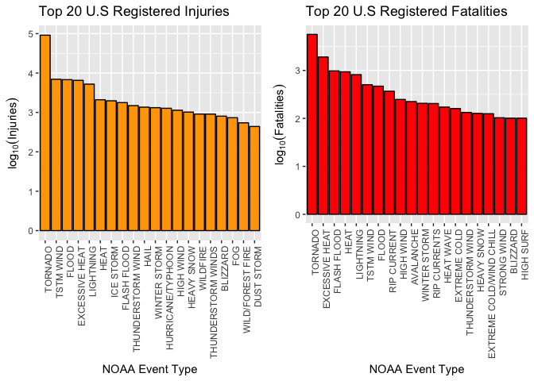
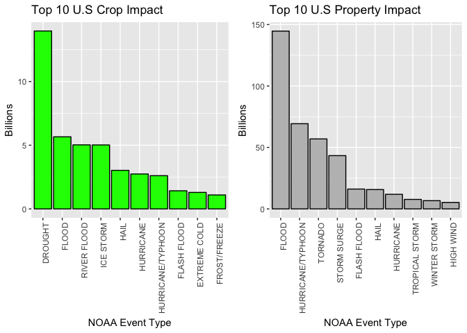
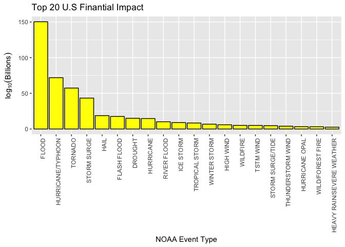

# Impact of Storms and Severe Weather Changes on Economic and Public Health
André Campos <andreloc@gmaill.com>  
10/14/2017  

By André Campos (andreloc@gmail.com)
Date: 19-14-201

## Synopsis 

Storms and other severe weather events can cause both public health and economic 
problems for communities and municipalities. Many severe events can result in 
fatalities, injuries, and property damage, and preventing such outcomes to the 
extent possible is a key concern. This study will describe the impact of such weather 
conditions on U.S health and economics. The study is based on the National 
Oceanic and Atmospheric Administration's (NOAA) storm database. 

### Study Goal 

The basic goal is to explore the NOAA Database and answer the following questions: 

1. Across the United States, which types of events are most harmful with respect to population health?
2. Across the United States, which types of events have the greatest economic consequences?

This report is intended for government or municipal manager who might be responsible 
for preparing for severe weather events. 

## Basic setup  

This section briefly show the required libraries. 

This project uses [packrat][4] for dependency management and easly to be deployed 
in any machine. 

## Data Processing

The NOAA database is a compressed CSV file. The data was downloaded in the folloing 
link [Sorm Data][1]. There is also some documentation of the database available 
on the [Storm Data Documentation][2] and a serie of [Frequent Answered Questions][3]. 

The events in the database start in the year 1950 and end in November 2011. In the earlier 
years of the database there are generally fewer events recorded, most likely due to a lack 
of good records. More recent years should be considered more complete.

### Download

The following R scripts download and unzip the data from the storm database. 

```r
download.url <- "https://d396qusza40orc.cloudfront.net/repdata%2Fdata%2FStormData.csv.bz2"
dest.file <- "storm_data.csv.bz2"
if(!file.exists(dest.file)){
    download.file(download.url, destfile = dest.file)
}
dataset <- read.csv(dest.file)
```


### Creating the analitical dataset 
The next step is to remove unused information from the dataset in order to facilitate 
interpretation of the available information. 

1. What are the available columns? 

```r
names(dataset)
```

```
##  [1] "STATE__"    "BGN_DATE"   "BGN_TIME"   "TIME_ZONE"  "COUNTY"    
##  [6] "COUNTYNAME" "STATE"      "EVTYPE"     "BGN_RANGE"  "BGN_AZI"   
## [11] "BGN_LOCATI" "END_DATE"   "END_TIME"   "COUNTY_END" "COUNTYENDN"
## [16] "END_RANGE"  "END_AZI"    "END_LOCATI" "LENGTH"     "WIDTH"     
## [21] "F"          "MAG"        "FATALITIES" "INJURIES"   "PROPDMG"   
## [26] "PROPDMGEXP" "CROPDMG"    "CROPDMGEXP" "WFO"        "STATEOFFIC"
## [31] "ZONENAMES"  "LATITUDE"   "LONGITUDE"  "LATITUDE_E" "LONGITUDE_"
## [36] "REMARKS"    "REFNUM"
```

2. What are the dimensions of the table? 

```r
dim(dataset)
```

```
## [1] 902297     37
```

3. Finally, using the [documentation][2] to select the right information to 
manipulate

```r
clean.dataset <- dataset %>% select(EVTYPE, FATALITIES, INJURIES, 
                                    CROPDMG, CROPDMGEXP, PROPDMG, PROPDMGEXP) 
```

## Collecting Fine Grained Analytical Data
The steps below will focus on separting the important data to be used on the 
analysis of health and economic impact.

### Across the U.S, which types of events are most harmful with respect to population health?

First, lets group the subset of relevant data for health impact. 

```r
health.impact <- clean.dataset %>% group_by(EVTYPE) %>% summarise(
                        Fatalities = sum(FATALITIES, na.rm = T), 
                        Injuries = sum(INJURIES, na.rm = T)
                    ) %>% rename("Event" = EVTYPE)
```

#### Injuries

Now, subselect summarise the injuries. The dataset will be ordered by the top 
relevant events as shown in the top 10 table below. 

```r
health.impact.by.injuries <- health.impact %>% arrange(desc(Injuries))
top.injuries <- head(health.impact.by.injuries %>% select(Event, Injuries))
kable(top.injuries, format = "markdown")
```


|Event          | Injuries|
|:--------------|--------:|
|TORNADO        |    91346|
|TSTM WIND      |     6957|
|FLOOD          |     6789|
|EXCESSIVE HEAT |     6525|
|LIGHTNING      |     5230|
|HEAT           |     2100|

#### Fatalities

Now, subselect summarise the fatalities. The dataset will be ordered by the top 
relevant events as shown in the top 10 table below. 

```r
health.impact.by.fatalities <- health.impact %>% arrange(desc(Fatalities))
top.fatalities <- head(health.impact.by.fatalities %>% select(Event, Fatalities))
kable(top.fatalities, format = "markdown")
```


|Event          | Fatalities|
|:--------------|----------:|
|TORNADO        |       5633|
|EXCESSIVE HEAT |       1903|
|FLASH FLOOD    |        978|
|HEAT           |        937|
|LIGHTNING      |        816|
|TSTM WIND      |        504|

### Across the U.S, which types of events have the greatest economic consequences?

First, we will need to normalize the property damage and crop damage data into 
comparable numerical values. As described in the [code book (Storm Events)][2]. 
Both PROPDMGEXP and CROPDMGEXP columns record a multiplier for each observation 
where we have Hundred (H), Thousand (K), Million (M) and Billion (B).

The function belows converts the values: 

```r
ConvertValueToUnities <- function(value, exp){
    exp <- trimws(exp)   # remove leading spaces
    exp <- toupper(exp)  # 
    switch (
        as.vector(exp),
        "H" = 10^2 * value,
        "K" = 10^3 * value,
        "M" = 10^6 * value,
        "B" = 10^9 * value,
        value
    )
}

clean.dataset$CROPDMG.TOTAL <- mapply(ConvertValueToUnities, clean.dataset$CROPDMG, clean.dataset$CROPDMGEXP)
clean.dataset$PROPDMG.TOTAL <- mapply(ConvertValueToUnities, clean.dataset$PROPDMG, clean.dataset$PROPDMGEXP)
```

Now the results below group the total finantial impact grouped by the NOAA event. 


```r
finantial.impact <- clean.dataset %>% group_by(EVTYPE) %>% summarise(
                        "Crop Impact" = sum(CROPDMG.TOTAL, na.rm = T), 
                        "Property Impact" = sum(PROPDMG.TOTAL, na.rm = T), 
                    ) %>% rename("Event" = EVTYPE) %>% 
                      mutate(`Total Impact` = `Crop Impact`+`Property Impact`) %>% 
                      arrange(desc(`Total Impact`)) 
finantial.impact$`Crop Impact` <- round(finantial.impact$`Crop Impact`/1000000000,3)
finantial.impact$`Property Impact` <- round(finantial.impact$`Property Impact`/1000000000,3)
finantial.impact$`Total Impact` <- round(finantial.impact$`Total Impact`/1000000000,3)
```

#### Top Crop Impact (Billions)


```r
finantial.impact.by.crop <- finantial.impact %>% arrange(desc(`Crop Impact`))
top.crop.impact <- head(finantial.impact.by.crop %>% select(Event, `Crop Impact`))
kable(top.crop.impact, format = "markdown")
```


|Event       | Crop Impact|
|:-----------|-----------:|
|DROUGHT     |      13.973|
|FLOOD       |       5.662|
|RIVER FLOOD |       5.029|
|ICE STORM   |       5.022|
|HAIL        |       3.026|
|HURRICANE   |       2.742|

#### Top Property Impact (Billions)


```r
finantial.impact.by.property <- finantial.impact %>% arrange(desc(`Property Impact`))
top.property.impact <- head(finantial.impact.by.property %>% select(Event, `Property Impact`))
kable(top.property.impact, format = "markdown")
```


|Event             | Property Impact|
|:-----------------|---------------:|
|FLOOD             |         144.658|
|HURRICANE/TYPHOON |          69.306|
|TORNADO           |          56.937|
|STORM SURGE       |          43.324|
|FLASH FLOOD       |          16.141|
|HAIL              |          15.732|

#### The total sum of finantial impact

#### Creating Plot Information


```r
injuries.plot <- ggplot(data = head(health.impact.by.injuries,20), 
            aes(x = reorder(Event, -Injuries), y = log10(Injuries))) +
    geom_bar(stat = "identity", fill="orange", colour = "black") +
    theme(axis.text.x = element_text(angle = 90, hjust = 1)) + 
    ggtitle("Top 20 U.S Registered Injuries") +
    labs(y=expression(log[10](Injuries)), x = "NOAA Event Type")

fatalities.plot <- ggplot(data=head(health.impact.by.fatalities,20), 
                          aes(x = reorder(Event, -Fatalities), y = log10(Fatalities))) +
    geom_bar(stat = "identity", fill="red", colour = "black") +
    theme(axis.text.x = element_text(angle = 90, hjust = 1)) + 
    ggtitle("Top 20 U.S Registered Fatalities") +
    labs(y=expression(log[10](Fatalities)), x = "NOAA Event Type")

crop.plot <- ggplot(data = head(finantial.impact.by.crop,10), 
            aes(x = reorder(Event, -`Crop Impact`), y = `Crop Impact`)) +
    geom_bar(stat = "identity", fill="green", colour = "black") +
    theme(axis.text.x = element_text(angle = 90, hjust = 1)) + 
    ggtitle("Top 10 U.S Crop Impact") +
    labs(y=expression(Billions), x = "NOAA Event Type")

finantial.plot <- ggplot(data = head(finantial.impact,20), 
            aes(x = reorder(Event, -`Total Impact`), y = `Total Impact`)) +
    geom_bar(stat = "identity", fill="yellow", colour = "black") +
    theme(axis.text.x = element_text(angle = 90, hjust = 1)) + 
    ggtitle("Top 20 U.S Finantial Impact") +
    labs(y=expression(log[10](Billions)), x = "NOAA Event Type")

crop.plot <- ggplot(data = head(finantial.impact.by.crop,10), 
            aes(x = reorder(Event, -`Crop Impact`), y = `Crop Impact`)) +
    geom_bar(stat = "identity", fill="green", colour = "black") +
    theme(axis.text.x = element_text(angle = 90, hjust = 1)) + 
    ggtitle("Top 10 U.S Crop Impact") +
    labs(y=expression(Billions), x = "NOAA Event Type")

property.plot <- ggplot(data=head(finantial.impact.by.property,10), 
                          aes(x = reorder(Event, -`Property Impact`), y = `Property Impact`)) +
    geom_bar(stat = "identity", fill="grey", colour = "black") +
    theme(axis.text.x = element_text(angle = 90, hjust = 1)) + 
    ggtitle("Top 10 U.S Property Impact ") +
    labs(y=expression(Billions), x = "NOAA Event Type")
```

## Results 

The final result of the analysis is presented in the following sections. 

### Health Impact 

The top cause of **injuries** in USA according to NOAA is 
**TORNADO**. 
The top cause of **fatalities** in USA according to NOAA is 
**TORNADO**. 


```r
grid.arrange(injuries.plot, fatalities.plot, ncol = 2)
```

<!-- -->

### Finantial Impact 
The highest finantial impact was caused by FLOOD. 
The finantial impact can be subdivided into Crop and Property impacts, which are detailed below. 


```r
grid.arrange(crop.plot, property.plot, ncol = 2)
```

<!-- -->

The main total impact is presented in the graph below. 

```r
plot(finantial.plot)
```

<!-- -->

## References

- [NOAA Database][1]
- [National Weather Service Storm Data Documentation][2]
- [NOAA Database FAQ][3]
- [Package manager][4]

[1]: https://d396qusza40orc.cloudfront.net/repdata%2Fdata%2FStormData.csv.bz2
[2]: https://d396qusza40orc.cloudfront.net/repdata%2Fpeer2_doc%2Fpd01016005curr.pdf
[3]: https://d396qusza40orc.cloudfront.net/repdata%2Fpeer2_doc%2FNCDC%20Storm%20Events-FAQ%20Page.pdf
[4]: https://rstudio.github.io/packrat/ 
