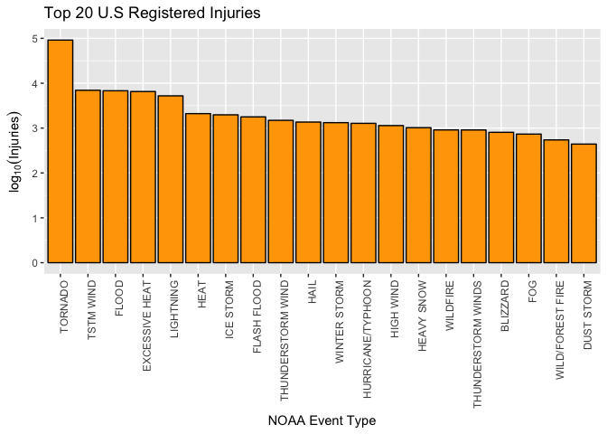
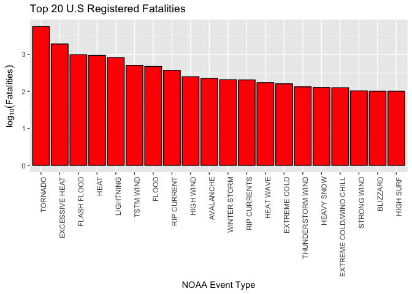

# Analysis of Impact of Storms and Severe Weather Changes on Economic and Public Health
André Campos <andreloc@gmaill.com>  
10/14/2017  
## Basic Information and Setup

Information obtained by exploring the U.S. National Oceanic and Atmospheric 
Administration's (NOAA) storm database

By André Campos (andreloc@gmail.com)
Date: 19-14-201

Basic setup of the article renderization. 


## Introduction 

Storms and other severe weather events can cause both public health and economic 
problems for communities and municipalities. Many severe events can result in 
fatalities, injuries, and property damage, and preventing such outcomes to the 
extent possible is a key concern.

### Study Goal 

The basic goal is to explore the NOAA Storm Database and answer the following questions: 

1. Across the United States, which types of events are most harmful with respect to population health?
2. Across the United States, which types of events have the greatest economic consequences?

This report is intended for government or municipal manager who might be responsible 
for preparing for severe weather events. 

## Obtaining and extracting the data 

The NOAA database is a compressed CSV file. The data was downloaded in the folloing 
link [Sorm Data][1]. There is also some documentation of the database available 
on the [Storm Data Documentation][2] and a serie of [Frequent Answered Questions][3]. 

The events in the database start in the year 1950 and end in November 2011. In the earlier 
years of the database there are generally fewer events recorded, most likely due to a lack 
of good records. More recent years should be considered more complete.

#### Download

The following R scripts download and unzip the data from the storm database. 

```r
download.url <- "https://d396qusza40orc.cloudfront.net/repdata%2Fdata%2FStormData.csv.bz2"
dest.file <- "storm_data.csv.bz2"
if(!file.exists(dest.file)){
    download.file(download.url, destfile = dest.file)
}
dataset <- read.csv(dest.file)
```

### Creating the analitical dataset 
The next step is to remove unused information from the dataset in order to facilitate 
interpretation of the available information. 

1. What are the available columns? 

```r
names(dataset)
```

```
##  [1] "STATE__"    "BGN_DATE"   "BGN_TIME"   "TIME_ZONE"  "COUNTY"    
##  [6] "COUNTYNAME" "STATE"      "EVTYPE"     "BGN_RANGE"  "BGN_AZI"   
## [11] "BGN_LOCATI" "END_DATE"   "END_TIME"   "COUNTY_END" "COUNTYENDN"
## [16] "END_RANGE"  "END_AZI"    "END_LOCATI" "LENGTH"     "WIDTH"     
## [21] "F"          "MAG"        "FATALITIES" "INJURIES"   "PROPDMG"   
## [26] "PROPDMGEXP" "CROPDMG"    "CROPDMGEXP" "WFO"        "STATEOFFIC"
## [31] "ZONENAMES"  "LATITUDE"   "LONGITUDE"  "LATITUDE_E" "LONGITUDE_"
## [36] "REMARKS"    "REFNUM"
```

2. What are the dimensions of the table? 

```r
dim(dataset)
```

```
## [1] 902297     37
```

3. Finally, using the [documentation][2] to select the right information to 
manipulate

```r
clean.dataset <- dataset %>% select(EVTYPE, FATALITIES, INJURIES, 
                                    CROPDMG, CROPDMGEXP, PROPDMG, PROPDMGEXP) 
```

## Analysis

The analysis below will focus on answering separetly the health and economic impact. 

### Across the United States, which types of events (as indicated in the 𝙴𝚅𝚃𝚈𝙿𝙴 variable) are most harmful with respect to population health?

First, lets group the subset of relevant data.

```r
health.impact <- clean.dataset %>% group_by(EVTYPE) %>% summarise(
                        Fatalities = sum(FATALITIES, na.rm = T), 
                        Injuries = sum(INJURIES, na.rm = T)
                    ) %>% rename("Event" = EVTYPE)
```

#### Injuries

The top cause of injuries in USA according to NOAA is `{r} head(health.impact.by.injuries$EVTYPE,1)`. 
The top 5 events are listed below. 

```r
health.impact.by.injuries <- health.impact %>% arrange(desc(Injuries))
top.injuries <- head(health.impact.by.injuries %>% select(Event, Injuries))
kable(top.injuries, format = "markdown")
```


|Event          | Injuries|
|:--------------|--------:|
|TORNADO        |    91346|
|TSTM WIND      |     6957|
|FLOOD          |     6789|
|EXCESSIVE HEAT |     6525|
|LIGHTNING      |     5230|
|HEAT           |     2100|


```r
plot(ggplot(data = head(health.impact.by.injuries,20), 
            aes(x = reorder(Event, -Injuries), y = log10(Injuries))) +
    geom_bar(stat = "identity", fill="orange", colour = "black") +
    theme(axis.text.x = element_text(angle = 90, hjust = 1)) + 
    ggtitle("Top 20 U.S Registered Injuries") +
    labs(y=expression(log[10](Injuries)), x = "NOAA Event Type"))
```

<!-- -->

#### Fatalities

The top cause of fatalities in USA according to NOAA is `{r} head(health.impact.by.fatalities$EVTYPE,1)`. 
The top 5 events are listed below. 

```r
health.impact.by.fatalities <- health.impact %>% arrange(desc(Fatalities))
top.fatalities <- head(health.impact.by.fatalities %>% select(Event, Fatalities))
kable(top.fatalities, format = "markdown")
```


|Event          | Fatalities|
|:--------------|----------:|
|TORNADO        |       5633|
|EXCESSIVE HEAT |       1903|
|FLASH FLOOD    |        978|
|HEAT           |        937|
|LIGHTNING      |        816|
|TSTM WIND      |        504|


```r
plot(ggplot(data=head(health.impact.by.fatalities,20), aes(x = reorder(Event, -Fatalities), y = log10(Fatalities))) +
    geom_bar(stat = "identity", fill="red", colour = "black") +
    theme(axis.text.x = element_text(angle = 90, hjust = 1)) + 
    ggtitle("Top 20 U.S Registered Fatalities") +
    labs(y=expression(log[10](Fatalities)), x = "NOAA Event Type"))
```

<!-- -->


### Across the United States, which types of events have the greatest economic consequences?


## Important Links

- [NOAA Database][1]
- [National Weather Service Storm Data Documentation][2]
- [NOAA Database FAQ][3]

[1]: https://d396qusza40orc.cloudfront.net/repdata%2Fdata%2FStormData.csv.bz2
[2]: https://d396qusza40orc.cloudfront.net/repdata%2Fpeer2_doc%2Fpd01016005curr.pdf
[3]: https://d396qusza40orc.cloudfront.net/repdata%2Fpeer2_doc%2FNCDC%20Storm%20Events-FAQ%20Page.pdf

